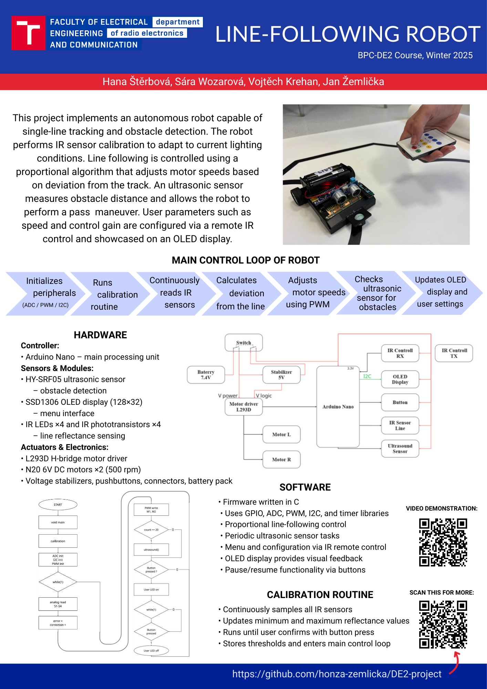
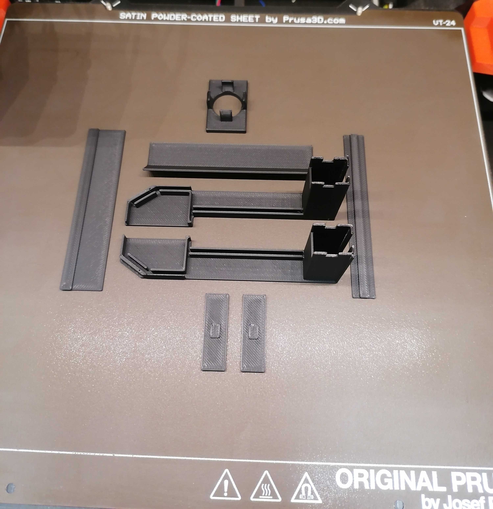
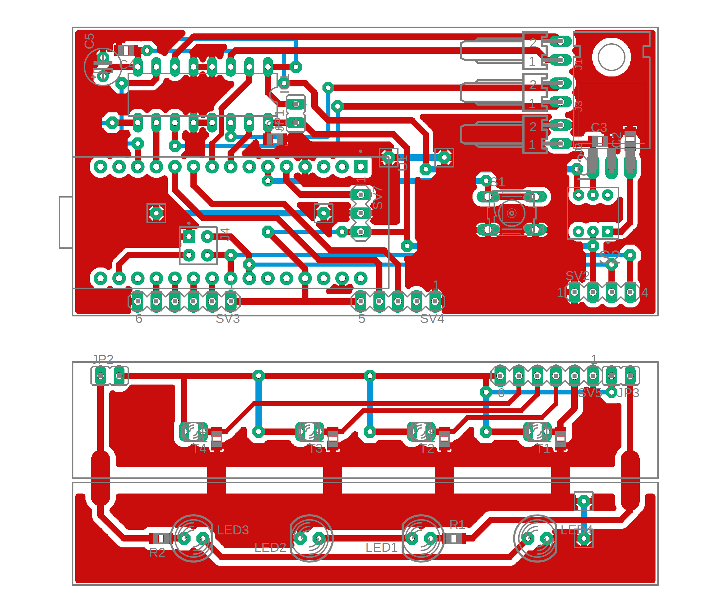
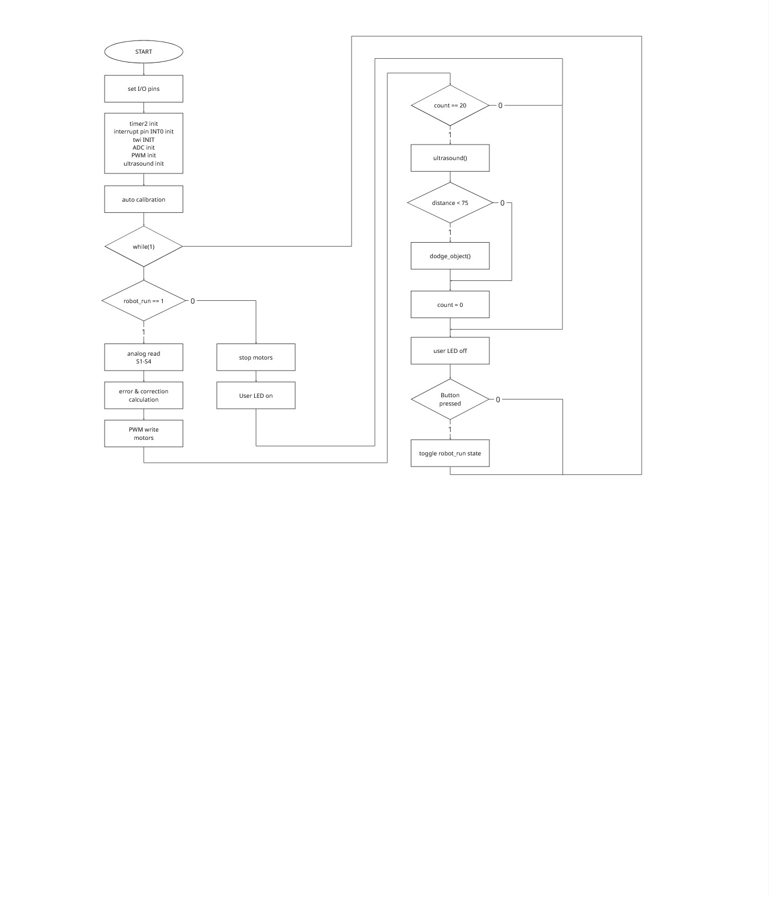

# DE2 line-following robot project

### Team members

* Hana Štěrbová
* Sára Wozarová
* Vojtěch Krehan
* Jan Žemlička

## Project description
This project presents an autonomous robot designed for line following and obstacle avoidance. On startup, the robot performs an calibration routine to distinguish between black and white surfaces under current lighting conditions. It utilizes a proportional (P) control algorithm to follow the line by adjusting the speed of individual motors based on robot's deviation from the followed path.
		
An ultrasonic sensor continuously measures the distance from obstacles. If an object is detected within a threshold distance, the robot initiates a avoidance maneuver to bypass the obstacle and return to the track.
		
Users can configure parameters as control gain and robot speed via remote IR controller. The current settings are displayed on an OLED screen.

The robot’s firmware, written in C, utilizes libraries from the [DE2 AVR course](https://github.com/tomas-fryza/avr-labs) – gpio, oled & twi libraries (+ uart for troubleshooting). Additionally, a custom ultrasound library was created to handle sensors initialization & distance calculation.

## [**Video demonstration of our project**](https://youtu.be/tJKh0oyu3Gs?si=n_vKxXadf_YJ9QNw)



## Hardware description


> Hardware block diagram

* [Arduino Nano](datasheets/ArduinoNANO-datasheet.pdf) - main controller unit ([ATmega328P](datasheets/ATmega328P_Datasheet.pdf))

##### Modules

* [HY-SRF05 precision ultrasonic sensor](datasheets/m475c.pdf) - for obstacle distance measurement
* I2C OLED display 128x32, SSD1306 driver

##### Components

* [L293D](datasheets/l293d.pdf) - dual H-bridge driver used for motor control
* DC motor N20 (500rpm/6V) - 2x
* [IR333C/H0/L10](datasheets/IR_LED_ir333c.pdf) - IR emitter - 4x
* [PT334-6B](datasheets/IR_phototransistorpt3346b.pdf) - IR sensor receiver - 4x
* [OS-1838B](datasheets/IR_receiver_vs1838b.pdf) - IR remote control receiver
* stabilizer, buttons, connectors, batteries ...

### Wiring

| Component | Arduino Pin | AVR Port | Function |
| :--- | :---: | :---: | :--- |
| **Left Motor FWD** | D5 | PD5 | PWM Speed Control |
| **Left Motor BCK** | D9 | PB1 | PWM Backspeed Control|
| **Right Motor FWD** | D6 | PD6 | PWM Speed Control |
| **Right Motor BCK** | D10 | PB2 | PWM Backspeed Control |
| **Line Sensor RR** | A0 | PC0 | IR Line Input (Right-Right) |
| **Line Sensor CR** | A1 | PC1 | IR Line Input (Center-Right) |
| **Line Sensor CL** | A2 | PC2 | IR Line Input (Center-Left) |
| **Line Sensor LL** | A3 | PC3 | IR Line Input (Left-Left) |
| **Ultrasonic Trig**| D8 | PB0 | Trigger Output |
| **Ultrasonic Echo**| D7 | PD7 | Echo Input |
| **IR Receiver** | D2 | PD2 | Remote Data (INT0) |
| **User Button** | D3 | PD3 | Resume/Pause Button |
| **ArduinoNano LED** | D13 | PB5 | Status Indicator |
| **OLED SDA** | A4 | PC4 | I2C Data |
| **OLED SCL** | A5 | PC5 | I2C Clock |

### 

#### Robot mechanical structure & PCB

<p float="center">
  
   
</p>

## Software design

<div align="center">
    
    <br>
    <em>Main loop flowchart</em>
</div>

The program initializes peripherals (ADC, I2C, PWM & ultrasound) and runs a calibration routine. After calibration, it enters an infinite control loop that: 

1. Reads normalized analog values from IR sensors.
2. Calculates the error and applies P-regulator correction to motor speeds.
3. Periodically measures distance using the ultrasound sensor.
4. Decodes IR remote commands via interrupts (if an command is received).

Upon pressing the button, the robot enters an stop state. Upon pressing the button again, robot resumes main loop execution.

<div align="center">

    <br>
    <br>
    <em>Calibration loop flowchart</em>
</div>

For calibration routine, the robot spins in place for a fixed duration, while IR line sensors values are continuously sampled, updating the minimum (black) and maximum (white) thresholds. These values are stored and used to normalize sensor readings during the main loop.

After the calibration time elapses, the robot aligns itself with the line and waits for a manual button press to start the main run loop.

### [Doxygen Documentation](https://honza-zemlicka.github.io/DE2-project/Doxygen_html/index.html)

#### Project structure

 ```c
      DE2-project_final            // PlatfomIO project
      ├── include
      │   ├── timer.h              // Tomas Fryza timer library
      |   └── robot_definitions.h  // Pin mapping & IR hex codes
      ├── lib
      │   ├── qpio                 // Tomas Fryza GPIO library
      │   │   ├── gpio.c
      │   │   └── gpio.h
      │   ├── oled                 // Michael Köhler's OLED library
      │   │   ├── font.h
      │   │   ├── oled.c
      │   │   └── oled.h
      │   ├── twi                  // Tomas Fryza TWI library
      │   │   ├── twi.c
      │   │   └── twi.h
      │   └── uart                 // Peter Fleury's UART library
      │       ├── uart.c
      │       └── uart.h
      ├── src
      │   └── main.c               // main app source code
      ├── test           
      └── platformio.ini           // project config
```

## References

- https://github.com/tomas-fryza/avr-labs
- https://miro.com/
- https://chatgpt.com/
- https://gemini.google.com/
